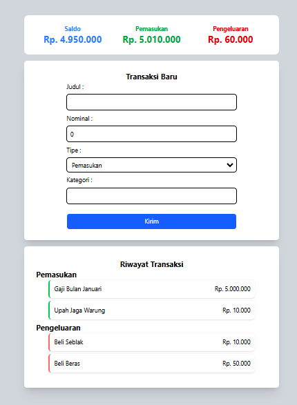

# Personal Finance Tracker - React JS

Aplikasi pengelola keuangan sederhana dan fungsional yang dibangun dengan **React** dan **Tailwind CSS**.

## Fitur
- **Operasi CRUD:** Menambahkan dan melihat transaksi keuangan.
- **Perhitungan Otomatis:** Perhitungan saldo total, pemasukan, dan pengeluaran secara real-time menggunakan `reduce()`.
- **Penyimpanan Data:** Menggunakan `LocalStorage` agar data tetap tersimpan meskipun halaman di-refresh.
- **Tampilan Modern:** Desain dashboard yang bersih dengan Tailwind CSS dan format mata uang Rupiah.

## Teknologi
- **React (Vite)**
- **Tailwind CSS**
- **JavaScript (ES6+)**

